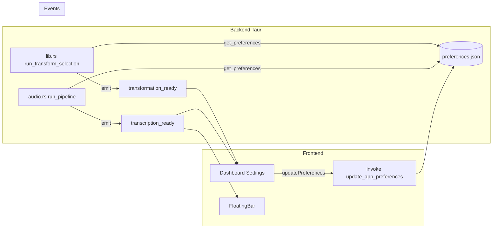

# Stratégie d'implémentation des nouvelles fonctionnalités

**État** : Le son à la fin du traitement (`sound_on_complete`) et les notifications système (`system_notification`) sont **implémentés** (backend émet `play_completion_sound`, lit les préfs dans `audio.rs` et `lib.rs`). Le reste du document reste une référence pour le pattern préférence → condition → action.

Contexte : intégration harmonieuse dans l'écosystème Ghosty existant, en tenant compte des retours (toggles Comportement partiellement non branchés, option Paste Original+Result récemment ajoutée). Objectif : fluidité, cohérence et adoption sans surcharge cognitive ni changements abrupts.

---

## 1. Analyse des remarques précédentes – besoins clés

| Retour | Besoin identifié | Priorité |
|--------|------------------|----------|
| Toggles "Sound on complete" et "System notifications" sauvegardent la préférence mais aucun code n’agit dessus | Brancher le comportement sur les préfs existantes (son + notification système à la fin du traitement) | Haute |
| Option "Paste Original + Result" | Déjà implémentée : préférence + backend (audio + transform selection) + UI ; sert de **référence** pour le pattern d’intégration | Référence |
| Éviter changements abrupts | Nouveaux réglages avec défaut conservant le comportement actuel ; pas de rupture pour les utilisateurs existants | Contrainte |
| Performance et charge cognitive | Une seule source de vérité (preferences.json) ; pas d’options redondantes ; décisions prises au bon endroit (backend quand déjà en Rust) | Contrainte |

**Besoins clés résumés :**

- Rendre **effectifs** les réglages déjà exposés (sound, system notification).
- Suivre le **même pattern** que Paste Original+Result : préférence → lecture en backend (ou front si pertinent) → comportement conditionnel.
- Garder les **défauts** non intrusifs (ex. `system_notification: false` par défaut pour ne pas surprendre).

---

## 2. Écosystème actuel et interactions

**Points d’intégration pour son et notification :**

- **Où agir** : à la fin du traitement réussi.
  - Voix : dans `audio.rs` après `copy_to_clipboard` / avant ou après `emit("transcription_ready", ...)`.
  - Transform selection : dans `lib.rs` dans `run_transform_selection` après copie / avant `emit("transformation_ready", ...)`.
- **Qui lit les préfs** : le backend a déjà `get_preferences(&app)` dans ces chemins ; il peut lire `behavior.sound_on_complete` et `behavior.system_notification` sans nouveau flux.
- **Cohérence** : même approche que `paste_input_and_output` et `auto_paste_after_transform` (lire les préfs, agir conditionnellement).

---

## 3. Plan d’implémentation étape par étape

### 3.1 Son à la fin du traitement (Sound on complete)

| Étape | Action | Fichiers / détails |
|-------|--------|---------------------|
| 1 | Choisir le mécanisme | Option A : backend (Rust) joue un son système (e.g. `tauri-plugin-os` ou appel natif macOS `NSSound` / `afplay`). Option B : backend émet un event dédié `play_completion_sound` ; le front joue un fichier audio. Recommandation : **Option B** pour éviter dépendances natives lourdes ; un fichier `.wav`/`.mp3` dans les assets, joué via `<audio>` ou `AudioContext` sur `play_completion_sound`. |
| 2 | Backend : émettre l’event si préf activée | Dans `audio.rs` après succès du pipeline : `if prefs.behavior.sound_on_complete { let _ = app.emit("play_completion_sound", ()); }`. Idem dans `lib.rs` dans `run_transform_selection` après succès. |
| 3 | Frontend : listener et lecture | Dans `Dashboard.tsx` et/ou `FloatingBar.tsx` (ou un hook partagé) : `listen("play_completion_sound", () => { /* play asset */ })`. Un seul endroit suffit (ex. Dashboard ou FloatingBar, selon la fenêtre active). Fichier son court (< 0,5 s) dans `public/` ou `src/assets`. |
| 4 | Défaut | Garder `sound_on_complete: true` par défaut (déjà le cas) ; pas de changement de comportement pour qui l’a déjà. |

### 3.2 Notification système (System notifications)

| Étape | Action | Fichiers / détails |
|-------|--------|---------------------|
| 1 | Mécanisme | Tauri : `tauri-plugin-notification` (multi‑plateforme) ou API macOS native. Recommandation : **tauri-plugin-notification** pour cohérence et simplicité. |
| 2 | Backend : afficher si préf activée | Après succès dans `audio.rs` et `run_transform_selection` : `if prefs.behavior.system_notification { /* show notification */ }`. Soit commande Tauri dédiée `show_completion_notification(title, body)` qui appelle le plugin, soit appel direct au plugin depuis le backend si exposé. |
| 3 | Contenu | Titre court (ex. "Ghosty"), corps (ex. "Transcription ready" / "Transformation ready") pour ne pas surcharger. Pas de corps long (éviter surcharge cognitive). |
| 4 | Défaut | Garder `system_notification: false` par défaut ; les utilisateurs qui veulent les notifications les activent. |

### 3.3 Ordre recommandé

1. **Sound on complete** (event + lecture front ou backend) – impact immédiat, peu de dépendances.
2. **System notifications** (plugin + lecture des préfs) – une dépendance explicite, même pattern.

Chaque fonctionnalité peut être livrée et testée séparément (feature small, risque limité).

---

## 4. Fluidité et acceptation par les utilisateurs

- **Défauts conservateurs** : pas de son ou notification imposés par défaut si le comportement actuel ne les avait pas ; les nouveaux réglages n’altèrent pas le flux existant quand désactivés.
- **Découvrabilité** : les toggles sont déjà dans Comportement avec des libellés clairs ; pas besoin d’ajouter d’autres entrées pour ces deux options.
- **Rollback simple** : désactiver le toggle = comportement identique à aujourd’hui (pas de son, pas de notification).
- **Pas de migration** : les champs préfs existent déjà ; on ne touche pas au schéma des préférences.
- **Tests manuels** : décrire dans `GUIDE-TESTS-MANUELS.md` les cas "Sound on" / "Sound off" et "System notification on" / "off" après voix et après transform selection.

---

## 5. Meilleures pratiques d’intégration (réutilisables)

1. **Une source de vérité** : les préférences dans `preferences.json` ; le backend lit via `get_preferences(&app).unwrap_or_default()` au moment de l’action. Pas de duplication de logique (ex. ne pas faire "if sound then emit" côté front sans que le backend respecte la préf).
2. **Pattern préf → condition → action** : comme pour `paste_input_and_output` et `auto_paste_after_transform` : lire la préf, si true alors effectuer l’action (copie étendue, paste, son, notification). Même schéma pour toute nouvelle option de comportement.
3. **Événements explicites** : pour le son, un event dédié (`play_completion_sound`) garde le backend découplé du détail "comment" le son est joué (front ou autre).
4. **Performance** : pas de polling ; lecture des préfs uniquement aux points de décision (fin de pipeline, fin de transform). Pas d’impact sur la latence du flux principal.
5. **Cohérence UI** : une nouvelle option = une entrée dans la section appropriée (Comportement / Apparence / etc.) avec label + description courte ; pas de multiplication de sections pour une seule option.
6. **Changement non abrupt** : toute nouvelle option avec `#[serde(default)]` et valeur par défaut explicite dans `Default` ; les anciens fichiers de préfs sans le champ continuent de fonctionner.

---

## 6. Exemple concret d’intégration réussie (référence)

L’option **Paste Original and Result (processed modes)** illustre le pattern à répliquer :

- **Préférence** : `BehaviorPrefs.paste_input_and_output` (défaut `false`), sérialisation camelCase `pasteInputAndOutput`.
- **Backend** : dans `audio.rs` et `lib.rs`, `let prefs = get_preferences(&app).unwrap_or_default();` puis condition sur `prefs.behavior.paste_input_and_output` et mode (voice) ou prompt (transform) ; construction du texte à copier, puis `copy_to_clipboard(&text_to_copy, ...)`.
- **Frontend** : type `pasteInputAndOutput?: boolean` dans `behavior` ; un `SettingsRow` + `ToggleSwitch` dans la section Comportement, sans condition d’affichage inutile.
- **Résultat** : pas de régression quand l’option est off ; quand elle est on, comportement prévisible et format fixe (Original / Result).

En appliquant le même schéma à **sound_on_complete** (event + lecture côté front ou backend) et **system_notification** (appel plugin après lecture des préfs), on assure une intégration harmonieuse et maintenable.
